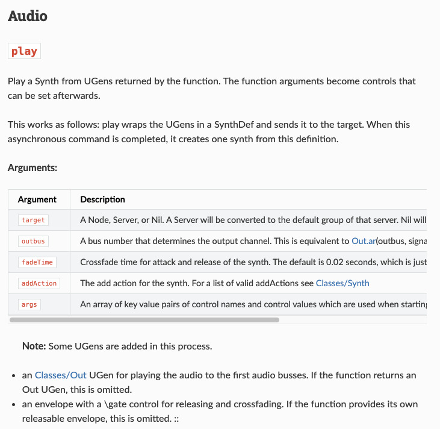

# schelp2

This is an initial attempt at making a *new* helpfile system for SuperCollider. It is still very much a work in progress. Collaboration is invited! 

## Why does this exist?

Early discussions and planning can be read in [this document](https://hedgedoc.musikinformatik.net/lLCXuzXtRwu6WlPs7CixFw#) created by @capital-G.

The short version is that the `.schelp` syntax/parsing/serving is convoluted, not well documented, and at this point, antiquated. Since it's creation (I think 13 years ago?) many tools have been developed that make creating, editing, maintaining, and serving help docs much easier. This plan is designed to modernize SC docs.

## The Plan

Currently this repo is just getting towards two goals:

### 1. Automatic translation of `.schelp` into `.md`.

This repo uses a modified version of the existing `.schelp` Flex/Bison lexer-parser to extract the file structure from `.schelp` files (added JSON output, see `./SCDoc`). The binary in there now is compiled for Apple Silicon, you may need to compile your own. The output json is then used as the context for a jinja template to format the data properly (as a `.md` file) for consumption by Sphinx (more on that below). **This is *mostly* working.** Most of the files that get translated are excellent. There are annoying edge cases because of the idiosyncrasy of `.schelp` syntax and how it was parsed into HTML.

**This translation tool is intended to be used to do one, comprehensive translation of existing `.schelp` files. Most of the files that get translated do not need cleaning, however, some will need to be *cleaned* a bit after the translation. I imagine this won't actually be to difficult with the benefit of search and replace.**

I've spent many hours trying to get the translator (processing/templating) to work better so this cleaning *wouldn't* be necessary. Anyone is welcome to continue this work, however I'm more and more convinced that the amount of varieties in the help files makes this quite challenging. 

The good news is that because Sphinx does live-reload on the `.md` files it is very easy to make adjustments and quickly see the result. 
   
### 2. Serve HTML with Sphinx

The `.md` files are then consumed by Sphinx, which is a popular code-documentation website generator. There are many themes to choose from, search functionality, and other convenient features. I've chosen the 'readthedocs' theme because I find it to be very clean and readable. Eventually the `.md` and/or rendered HTML can be served locally from within the IDE for a user to navigate just like the existing help doc system. 

There are many `.schelp` files that do not live in the SuperCollider repo. These will need to be translated on a case-by-case basis. It is possible to use the existing SCDoc parser (part of `sclang`) to include those as HTML in the Sphinx build. **What would be preferred is for owners of those files to use the translator (clean a bit if needed) and replace them with `.md`**

## Contributing

Yes, please do. What I need help with:

1. Is this a good idea?
2. If anyone wants to keep "cleaning" the translator (finding and fixing edge cases, etc.) this is welcome. **Jinja wizards desired.**
3. If there are any Sphinx wizards out there, it would be great to get the Sphinx features tightened up (proper table of contents, side bar, etc.).
4. How will the HTML rendered by Sphinx be served from the IDE (I have no familiarity with the IDE operations)?
5. For `.schelp` files outside the SC repo, how might they be included in the served docs if they are *not* also in `.md` format and how can we encourage owners of those files to translate them.
6. I've researched some options and decided that Sphinx is probably our best option, but I'm open to hearing other opinions.

## Using this Repo

### 1. Setup Python Environment

Create and activate a virtual environment:

**macOS/Linux:**
```bash
python3 -m venv .venv
source .venv/bin/activate
```

**Windows (Command Prompt):**
```cmd
python -m venv .venv
.venv\Scripts\activate
```
### 2. Install dependencies

```
pip install -r requirements.txt
```

### 3. Compile `scdoc_parse_dump`

If not on Apple Silicon, you will need to compile the modified `.schelp` lexer/parser from SuperCollider (here in `./SCDoc`). There is a `build_parser.sh` script in there. I had to `brew install bison` to get the new version of Bison.

### 4. Convert SuperCollider Help Files

Convert `.schelp` files to `.json` and `.md`:

```bash
python batch_schelp_json_md.py -i /path/to/supercollider/HelpSource -j ./json -o ./docs
```

### 5. Build Documentation

**Using Make (recommended):**

choosing `make livehtml` will serve the docs locally (http://localhost:8000) and watch the `.md` files for changes so they can be viewed immediately!

```bash
make html      # Build HTML documentation
make serve     # Serve docs locally at http://localhost:8000
make github    # Build for GitHub Pages (includes .nojekyll)
make clean     # Remove build artifacts
make install   # Install Python dependencies only
make livehtml  # Auto-rebuild on changes (requires sphinx-autobuild)
```

Then open http://localhost:8000 in your browser.

**Windows users:**
```cmd
make.bat html
```

## Screenshot of Sphinx 'readthedocs' styling

